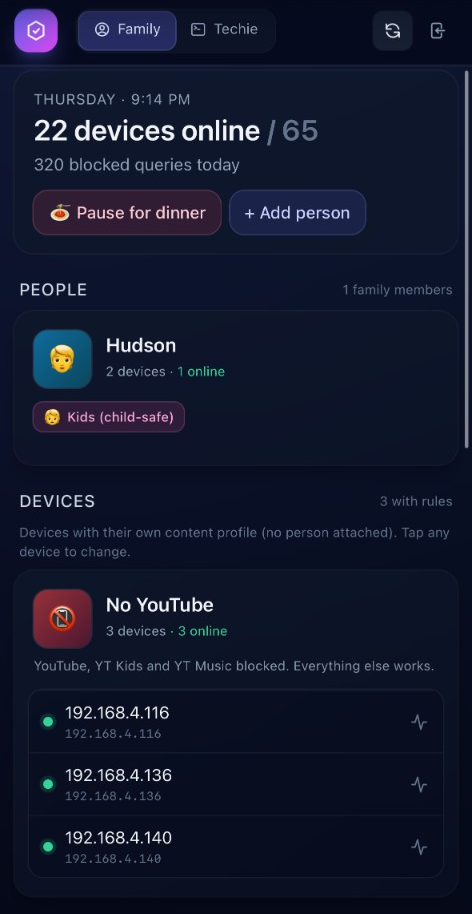
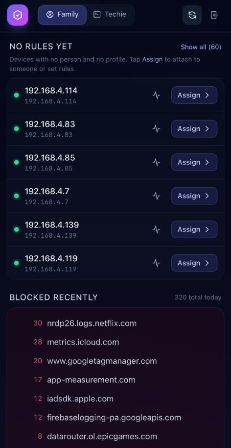
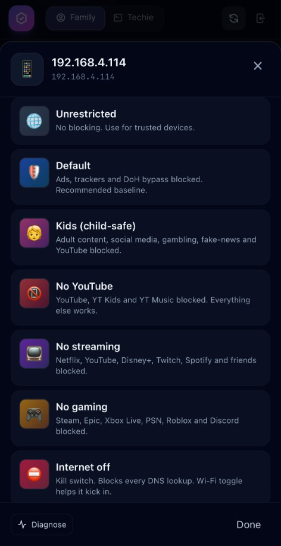
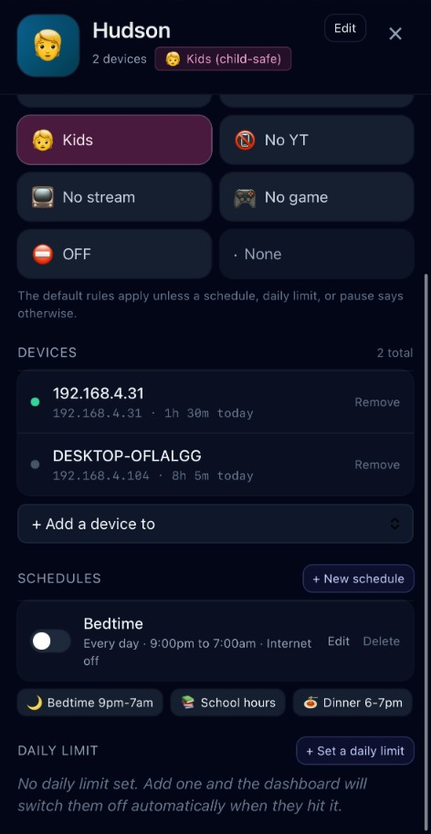

<div align="center">

# Guardium DNS

**Parental controls for [Technitium DNS](https://technitium.com/dns/).**

[](#status)
[](LICENSE)
[](#requirements)
[](https://technitium.com/dns/)

A self-hosted dashboard that turns Technitium DNS into a household-grade
parental control system for parents and home-labbers who want real visibility
and real control of the devices on their LAN — including the modern ones that
actively try to bypass your DNS server.

</div>

---

## Status

> [!WARNING]
> **Guardium DNS is in very early development.** It is a personal homelab
> project shared publicly so other parents and home-labbers can use it,
> learn from it, and contribute. APIs, schemas, and UI will change without
> notice. There is no upgrade path between versions yet. **Use at your own
> risk on your own network.**

This project exists because the author wanted a sane way to:

- protect his kids from things they shouldn't see online,
- enforce reasonable screen-time and category-based rules,
- and actually *win* the cat-and-mouse game against smart TVs, consoles and
  phones that ignore DHCP-provided DNS or use DNS-over-HTTPS (DoH) to bypass
  filtering entirely.

If that resonates with you, you're in the right place.

---

## Screenshots

The mobile-first **Family view** is what most parents will live in. The
**Techie view** (same data, denser tables, charts) is also available with a
tap.

<table>
  <tr>
    <td width="50%" valign="top">
      <a href="docs/screenshots/overview.png"></a>
      <p align="center"><sub><b>Family overview</b> — devices online, blocked-query counter, "Pause for dinner", people and per-profile device groups (here "No&nbsp;YouTube" is active on three devices, including the household's Google TV).</sub></p>
    </td>
    <td width="50%" valign="top">
      <a href="docs/screenshots/devices-list.png"></a>
      <p align="center"><sub><b>Devices needing rules</b> — every IP without a person or profile assignment is surfaced for one-tap "Assign". Below, a live feed of the most-blocked domains in the last day.</sub></p>
    </td>
  </tr>
  <tr>
    <td width="50%" valign="top">
      <a href="docs/screenshots/profile-picker.png"></a>
      <p align="center"><sub><b>Profile picker</b> — assign any of the seven built-in profiles (or your own custom ones) to a single device. Each profile maps directly to a group in the Technitium Advanced Blocking app.</sub></p>
    </td>
    <td width="50%" valign="top">
      <a href="docs/screenshots/person-detail.png"></a>
      <p align="center"><sub><b>Person detail</b> — a single household member with all their devices, a base profile, recurring schedules (bedtime, school hours, dinner), and an optional daily quota that auto-cuts the internet when hit.</sub></p>
    </td>
  </tr>
</table>

> Screenshots are from the author's home deployment, taken on iOS Safari
> over Tailscale. If you'd like to contribute screenshots from a different
> network (sensitive labels redacted), open a PR against
> `docs/screenshots/`.

---

## What it does

### For parents

- **Per-device profiles** with sensible defaults: `unrestricted`, `default`,
  `kids`, `no-streaming`, `no-gaming`, `no-youtube`, `internet-off`.
- **Per-person rules** — group devices under a household member ("Hudson",
  "Alex") and apply a single profile across all their devices.
- **Schedules** — bedtime, school hours, "homework mode". A profile change
  can apply on a recurring schedule (e.g. block all streaming Mon–Fri
  17:00–19:00).
- **Quotas** — daily caps per category or per app (e.g. 1 hour of YouTube
  per day, after which the category gets sinkholed).
- **One-click family pause** — kill the internet for everyone except the
  adults' devices, instantly.

### For home-labbers

- **Live visibility** into who's online, what they're querying, what's
  blocked, and at what rate.
- **MAC-anchored device tracking** — profiles follow a device across DHCP IP
  changes automatically.
- **Device fingerprinting** — every device gets a vendor (from MAC OUI) and
  a device-type hint (e.g. "Samsung Smart TV", "Apple device", "NVIDIA
  Shield") inferred from DNS query patterns. Helps you identify the rando
  `192.168.4.140` showing up in your logs.
- **Router integration (optional, three stages)** — push enforcement into
  your ASUS router for devices that ignore or bypass DNS-based blocking.
- **Idempotent reconciler** — every 60 seconds, dashboard state is
  reconciled against Technitium and (if configured) your router. Nothing is
  one-shot; everything self-heals.
- **Zero-Technitium-modification** — Guardium talks to Technitium only over
  its HTTP API. We never patch Technitium's binaries, configs on disk, or
  systemd unit. Technitium upgrades cannot break Guardium, and removing
  Guardium leaves Technitium untouched.

---

## How it works

### Architecture at a glance

```
                ┌────────────────────────────────────────────────────────┐
                │             Browser (any device on LAN)                │
                └───────────────────────┬────────────────────────────────┘
                                        │  HTTPS/HTTP
                                        ▼
        ┌──────────────────────────────────────────────────────────────┐
        │ Guardium DNS (FastAPI on :8080)                              │
        │                                                              │
        │  ┌─────────────┐  ┌───────────────┐  ┌────────────────┐      │
        │  │ Reconciler  │  │ Override      │  │ Sampler        │      │
        │  │  (60s loop) │  │  engine       │  │ (5min)         │      │
        │  └──────┬──────┘  └───────┬───────┘  └────────┬───────┘      │
        │         └──────────┬──────┴───────────────────┘              │
        │                    ▼                                         │
        │            ┌──────────────┐   ┌──────────────────────┐       │
        │            │ SQLite store │   │ Encrypted vault      │       │
        │            │ (devices,    │   │ (router credentials, │       │
        │            │  schedules,  │   │  Fernet-encrypted)   │       │
        │            │  usage…)     │   └──────────────────────┘       │
        │            └──────────────┘                                  │
        └──────┬─────────────────────┬─────────────────────────┬───────┘
               │ HTTP API            │ HTTP API                │ SSH / HTTP
               ▼                     ▼                         ▼
       ┌───────────────┐    ┌──────────────────┐    ┌─────────────────────┐
       │ Technitium    │    │ LAN gateway      │    │ ASUS router         │
       │ DNS Server    │    │ (PTR / dnsmasq)  │    │ (firewall + NVRAM)  │
       │ :5380         │    │                  │    │                     │
       └───────────────┘    └──────────────────┘    └─────────────────────┘
```

- **Backend**: Python 3.11+ / FastAPI / Uvicorn, single process under
  `dns-dashboard.service`.
- **Frontend**: Tailwind CSS + Alpine.js + Chart.js, no build step (CDN).
- **Storage**: SQLite at `/var/lib/dns-dashboard/dashboard.db`.
- **Port**: `8080` (Technitium itself stays on `5380`).
- **Auth**: reuses Technitium admin credentials. The login form proxies to
  Technitium's `/api/user/login`; the token comes back, gets stored in an
  HTTP-only cookie, and Guardium uses it on every backend call.

### Profiles → Technitium Advanced Blocking groups

Profiles are not invented by Guardium — they map 1:1 onto **groups in the
Technitium [Advanced Blocking](https://github.com/TechnitiumSoftware/DnsServer/blob/master/Apps/AdvancedBlockingApp/README.md) app**.
On first boot, Guardium seeds these six groups (only if they don't already
exist — your existing groups are never overwritten):

| Profile | Behaviour |
|---|---|
| `unrestricted` | No blocking. |
| `default` | Default ad/tracker blocklist (StevenBlack hosts). |
| `kids` | Default + adult / social / gambling / proxy categories. |
| `no-streaming` | Default + Netflix / YouTube / Disney+ / Twitch / Prime / etc. |
| `no-gaming` | Default + Steam / Epic / Xbox Live / PSN / Roblox / etc. |
| `internet-off` | Blocks `.*` via regex — total kill switch for the device. |

There is a catch-all group `default` mapped to `0.0.0.0/0`, so anything you
haven't explicitly assigned a profile gets sane ad/tracker blocking out of
the box.

### MAC-anchored device tracking

Technitium identifies devices by IP. That's a problem when your kid's phone
reboots and DHCP hands it a new lease — suddenly the `kids` profile is on
the *old* IP and the phone is unfiltered.

Guardium fixes this by tracking every device by **MAC address**:

1. The reconciler pulls the live client list from the router on every tick
   (`ip ↔ mac`).
2. If a known MAC has moved to a new IP, the device row in SQLite is
   atomically migrated to the new IP, carrying its label, profile,
   schedules, quotas, daily usage, person-membership, and favourite status.
3. Technitium's per-IP `networkGroupMap` is updated in the same pass; stale
   entries for the old IP are removed.

The result: profiles "stick" to devices across reboots and lease churn, no
manual intervention.

### Device fingerprinting

For every device, Guardium derives two hints:

1. **Vendor** — looked up from the MAC OUI against the
   [IEEE OUI registry](https://standards-oui.ieee.org/oui/oui.csv) (cached
   offline on first run, with Wireshark `manuf` mirrors as a fallback).
2. **Device-type hint** — a hand-curated rule set (`server/fingerprint.py`)
   scans the device's recent DNS queries against ~100 known domain
   patterns. Tier-1 specific (`shield.nvidia.com` → "NVIDIA Shield"),
   tier-2 vendor-only (`samsungelectronics.com` → "Samsung device"),
   tier-3 weak hint (`apple.com` → "Apple device").

Both run automatically in the background (≤5 devices/min), and you can
force-refresh a single device with the in-row identify button. Helps
enormously when a device shows up with a randomized MAC and no hostname.

### Router integration — three stages

DNS-level blocking is great. It is also **trivially bypassed** by any device
that hard-codes its own DNS (lots of smart TVs do) or uses DNS-over-HTTPS
(every modern phone, Chromecast, Google TV, Amazon Echo, etc.). Guardium
includes optional router integration to close those holes.

> [!NOTE]
> Router integration is **optional** but **strongly recommended** for
> households with smart TVs, gaming consoles, or any device you don't fully
> trust. Currently supports **ASUS routers** (RT-BE88U-class hardware
> verified; should work on any AsusWRT/Merlin device with the same NVRAM
> keys).

Router credentials (IP, username, password, optional SSH key) are stored
encrypted at rest using a Fernet key generated on first boot. Everything
the dashboard adds to your router is tagged or kept in a dedicated chain so
it can be cleanly removed without touching the rules you've added by hand.

#### Stage 1 — MAC-based "internet off" (HTTP)

Uses the router's built-in **MAC filter** feature (`MULTIFILTER_*` NVRAM
keys) to block specified MAC addresses at the firewall level. When a
device is on the `internet-off` profile, its MAC is added to the router's
block list; the device cannot send *any* IP traffic, not just DNS.

- **Defeats:** every form of DNS bypass (the device can't route at all).
- **Survives router reboot:** yes (NVRAM-persistent).
- **Requires:** HTTP admin access to the router. SSH not needed.

#### Stage 2 — DNS Director per MAC (HTTP)

Uses **DNS Director** (`dnsfilter_*` NVRAM keys) to transparently rewrite
every port-53 packet from a specific MAC to point at Technitium, even if
the device hard-codes `8.8.8.8` or `1.1.1.1`. Devices on any profile other
than `unrestricted` get steered into the dashboard's filter automatically.

- **Defeats:** hard-coded plain-DNS (UDP/TCP port 53) bypass.
- **Survives router reboot:** yes (NVRAM-persistent).
- **Requires:** HTTP admin access. SSH not needed.

#### Stage 3 — DoH IP blocklist (SSH + iptables/ipset)

This is the one that beat the TCL Google TV.

> #### The Google TV story
>
> Several Google-branded smart TVs (TCL, Sony, Hisense Google TVs;
> Chromecast with Google TV) **silently fall back to DNS-over-HTTPS
> against `dns.google` and `dns64.dns.google`** when their configured DNS
> can't satisfy them. They make outbound HTTPS to `8.8.8.8:443` /
> `8.8.4.4:443` and bypass everything in the DNS layer — including DoH
> hostname sinkholing, because they use the IP directly.
>
> Stage 3 fixes this by SSHing into the router (Dropbear) and:
>
> 1. creating an `ipset` (`dnsdash_doh`) populated with the IPv4/IPv6
>    addresses of known DoH endpoints (Google, Cloudflare, Quad9, NextDNS,
>    AdGuard, Mullvad, etc.),
> 2. installing iptables rules in a dedicated chain (`DNSDASH_DOH`) that
>    drop outbound TCP/443 (and TCP/853 for DoT) to any IP in the set,
>    scoped to the MACs of devices on a restricted profile.
>
> Result: the Google TVs queries `dns.google` for an `A` record, succeeds
> (because the DNS resolution itself isn't blocked), opens a TCP/443 to
> `8.8.8.8`, and the router silently drops the SYN. The TV falls back to
> the configured DNS — which is now Technitium, which now blocks YouTube
> for the `no-youtube` profile. Mission accomplished.

- **Defeats:** DNS-over-HTTPS bypass to known providers.
- **Survives router reboot:** rules need to be re-applied (the reconciler
  does this on every tick, so it's transparent).
- **Requires:** SSH access to the router with `iptables` + `ipset` + the
  `xt_set` kernel module. The dashboard probes for this on first run and
  reports back if the firmware doesn't have what it needs.

---

## What works without router integration

You can run Guardium with **zero router setup** and get a lot of value. The
table below shows what each layer can and can't do.

| Capability | DNS-only | + Stage 1 | + Stage 2 | + Stage 3 |
|---|:---:|:---:|:---:|:---:|
| Ad/tracker blocking on cooperative devices | ✅ | ✅ | ✅ | ✅ |
| Per-profile category blocking (kids, no-streaming, …) | ✅ | ✅ | ✅ | ✅ |
| Schedules, quotas, family pause | ✅ | ✅ | ✅ | ✅ |
| Block `internet-off` device that ignores DHCP DNS | ❌ | ✅ | ✅ | ✅ |
| Block device that hard-codes `8.8.8.8` plain DNS | ❌ | partial¹ | ✅ | ✅ |
| Block device that uses DoH (`dns.google` etc.) | ❌ | ✅² | ❌ | ✅ |
| Block device that uses DoT (port 853) | ❌ | ✅² | ❌ | ✅ |
| Block VPN bypass (Mullvad, NordVPN, …) | ❌ | ✅² | ❌ | partial³ |

¹ Stage 1 turns the device off entirely, so technically yes — but only as
"internet off", not selective.
² Stage 1 just kills all traffic, so it trivially blocks anything.
³ Stage 3 blocks well-known VPN provider IPs but it is a moving target.

**TL;DR**: DNS-only is fine for laptops, phones, Apple TVs, and any device
that respects DHCP. For smart TVs, game consoles, and anything Google-y,
enable Stage 2 and Stage 3.

---

## Requirements

- A Linux server (Debian/Ubuntu tested) with:
  - **Technitium DNS Server** installed and reachable on
    `http://127.0.0.1:5380`, with the **Advanced Blocking** app enabled,
  - Python 3.11+ and `python3-venv`.
- A permanent Technitium API token (the install script will prompt or
  accept one via `DASHBOARD_BOOT_TOKEN`).
- **Optional but recommended:** an ASUS router (AsusWRT or
  Merlin/Asuswrt-Merlin) with admin access. Stage 3 additionally needs SSH
  access and `iptables` + `ipset` (`xt_set`).

---

## Install

### One-shot, from your workstation

```bash
git clone https://github.com/<your-account>/guardium-dns.git
cd guardium-dns
./deploy.sh root@your-dns-server
```

`deploy.sh` rsyncs the project to `/opt/dns-dashboard/`, then runs
`deploy/install.sh` on the remote which:

1. installs Python + venv tooling if missing,
2. creates a dedicated `dns-dashboard` system user,
3. owns `/opt/dns-dashboard` and `/var/lib/dns-dashboard`,
4. builds a venv and installs Python deps,
5. writes `/etc/dns-dashboard.env` (only on first install),
6. installs and starts the `dns-dashboard.service` systemd unit.

When it's done you'll see something like:

```
==> done. Dashboard URL:  http://10.0.0.5:8080/
```

Open that URL, sign in with your Technitium admin user, and you're in.

### Manual install on the server

If you prefer to skip the rsync wrapper:

```bash
sudo git clone https://github.com/<your-account>/guardium-dns.git /opt/dns-dashboard
sudo bash /opt/dns-dashboard/deploy/install.sh
```

---

## Configuration

Everything tunable lives in `/etc/dns-dashboard.env` (read at service
start). Defaults are picked for a single-host deployment alongside
Technitium.

| Variable | Default | Purpose |
|---|---|---|
| `TECHNITIUM_URL` | `http://127.0.0.1:5380` | Technitium HTTP API base URL. |
| `TECHNITIUM_SERVICE_TOKEN` | *(empty)* | Permanent service token for boot-time setup (one-time; UI logins take over afterwards). |
| `DASHBOARD_HOST` | `0.0.0.0` | Bind address. |
| `DASHBOARD_PORT` | `8080` | Listen port. |
| `DASHBOARD_DATA_DIR` | `/var/lib/dns-dashboard` | SQLite + Fernet key location. |
| `DASHBOARD_WEB_DIR` | `/opt/dns-dashboard/web` | Static asset directory. |
| `LAN_DNS_RESOLVERS` | *(auto)* | Override LAN gateway used for PTR lookups (defaults to system default route). |

Router credentials are **not** stored in the env file; they go through the
**Settings → Router** UI and are encrypted at rest with a Fernet key
generated on first boot at `/var/lib/dns-dashboard/secret.key`.

---

## Security model

- **Authentication.** Guardium has no user database of its own. The login
  form forwards your credentials to Technitium's `/api/user/login`. The
  returned token is stored in a `HttpOnly`, `SameSite=Lax` cookie.
- **At-rest secrets.** Router passwords (and any other future secrets) are
  encrypted with Fernet (AES-128-CBC + HMAC-SHA256) using a key held in
  mode-0600 `/var/lib/dns-dashboard/secret.key`. Plain text never lives in
  the database, in logs, or on the wire to the browser.
- **In-transit.** Guardium currently listens on plain HTTP on `:8080`.
  Put it behind a reverse proxy (Caddy/Traefik/nginx) with TLS if you
  expose it beyond your LAN. There is no plan to bundle TLS termination.
- **No outbound calls** other than:
  - the local Technitium API,
  - the configured LAN gateway (PTR lookups),
  - your router (HTTP/SSH, only if configured),
  - a one-time IEEE/Wireshark OUI download cached to disk.
- **Router rules are tagged.** Everything we add to the router lives in
  named NVRAM list entries (Stages 1–2) or a dedicated iptables chain
  (`DNSDASH_DOH`, Stage 3). Disabling a stage in the UI triggers an
  automatic teardown on the next reconciler tick. Your manual router
  rules are never touched.

---

## Limitations and known issues

- **Single router vendor.** Only ASUS is implemented today. Adding
  OpenWrt/EdgeOS/UniFi is on the roadmap; PRs welcome.
- **DoH/DoT cellular bypass.** Stage 3 blocks DoH/DoT at the *home
  router*. A phone on cellular obviously isn't on your router and
  cannot be filtered. There is no software fix for this; it's a property
  of the device leaving your network.
- **DNS-over-HTTPS rotation.** Stage 3 ships a curated DoH IP list. New
  providers and new IP ranges appear constantly. The list is updated by
  hand for now.
- **No HA/clustering.** Single process, single SQLite file, single host.
  This is a household tool, not a service.
- **No automated upgrades or migrations** yet. Backups are your problem.
  Schema changes between commits may require deleting `dashboard.db`.
- **Per-IP, not per-user.** Two people sharing a laptop share a profile.
  "People" grouping helps but it's still device-scoped underneath.
- **TLS termination not bundled.** Put it behind a reverse proxy if you
  care.

---

## Project layout

```
guardium-dns/
├── server/
│   ├── app.py            FastAPI app + HTTP API
│   ├── technitium.py     Async Technitium API client
│   ├── profiles.py       Built-in profile definitions
│   ├── overrides.py      Effective-profile resolver (schedules + quotas)
│   ├── reconciler.py     60s reconciliation loop
│   ├── sampler.py        5min activity sampler (active-minutes per device)
│   ├── hostnames.py      LAN gateway PTR resolver
│   ├── apps.py           App/category usage rollups
│   ├── router_asus.py    AsusWRT HTTP client (Stages 1+2)
│   ├── router_ssh.py     AsusWRT SSH client (Stage 3)
│   ├── oui.py            IEEE OUI vendor lookup
│   ├── fingerprint.py    DNS-query-pattern device-type rules
│   ├── store.py          SQLite store
│   ├── vault.py          Fernet-encrypted secrets store
│   └── requirements.txt
├── web/
│   ├── index.html        Dashboard UI (Alpine.js SPA)
│   ├── login.html        Login screen
│   ├── app.js            Frontend logic
│   ├── styles.css        Custom CSS
│   └── favicon.svg       Shield icon
├── deploy/
│   ├── dns-dashboard.service
│   ├── install.sh
│   └── setup-reverse-forwarder.sh
├── scripts/
│   ├── identify_all_devices.py
│   └── live_test_mac_anchored.py
├── tests/
│   └── test_mac_anchored.py
├── deploy.sh             Push to remote + run install.sh
├── LICENSE               MIT
└── README.md
```

---

## Roadmap

- [ ] OpenWrt and UniFi router adapters
- [ ] Schedule editor UI (currently API/DB only)
- [ ] Per-app quotas with rich usage charts
- [ ] Mobile-first device list with swipe actions
- [ ] Automatic DoH IP list updates (live feed)
- [ ] Backup/export and schema-migration tooling
- [ ] Optional Prometheus metrics endpoint
- [ ] Docker image
- [ ] Multi-user accounts (separate from Technitium)

If you want a feature, [open an issue](../../issues/new) describing your
use case.

---

## Contributing

This is a one-person hobby project at the moment, but contributions are
welcome — especially:

- **Router adapters** for non-ASUS firmware,
- **Fingerprinting rules** for devices you've identified on your own
  network,
- **Bug reports** with reproduction steps, environment details, and
  reconciler logs (`journalctl -u dns-dashboard -n 200`).

For non-trivial changes, please open an issue first so we can talk about
the approach before you spend time on a PR.

---

## Acknowledgements

- [Technitium DNS Server](https://technitium.com/dns/) — the brilliant
  open-source recursive DNS server this whole project is built around.
  Huge thanks to [@ShreyasZare](https://github.com/ShreyasZare).
- [StevenBlack/hosts](https://github.com/StevenBlack/hosts) — the
  ad/tracker blocklist that powers the `default` profile.
- [Wireshark `manuf`](https://www.wireshark.org/) — fallback OUI database
  when the IEEE direct download is blocked.
- The countless homelab forum threads documenting AsusWRT NVRAM keys.

---

## License

[MIT](LICENSE). Do whatever you want, just don't blame me if it doesn't
work.

> **Disclaimer:** Guardium DNS is not affiliated with, endorsed by, or
> sponsored by Technitium, ASUS, or any other company referenced here.
> "Technitium" and "ASUS" are trademarks of their respective owners.
